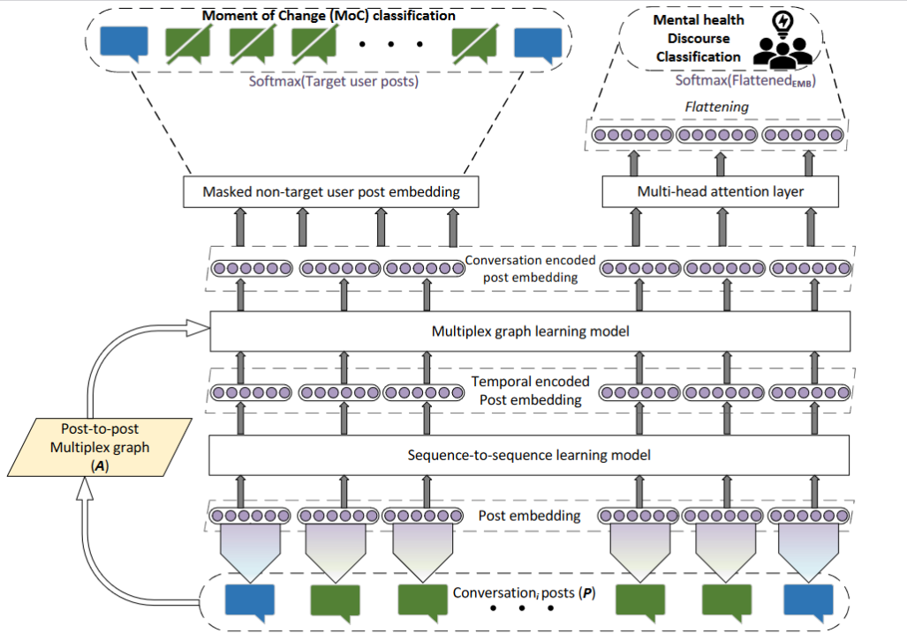
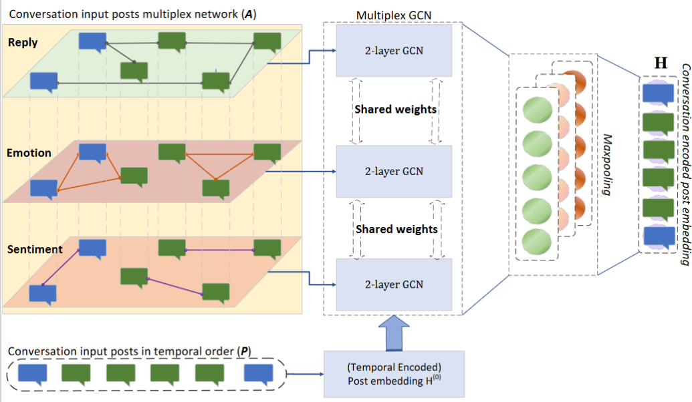

# AAAI 2024 Workshop W24: [ML4CHM 2024](https://winterlightlabs.github.io/ml4cmh2024/program/index.html)
## ConversationMoC: Encoding Conversational Dynamics using Multiplex Network for Identifying Moment of Change in Mood and Mental Health Classification
This work introduces a unique conversation-level dataset and investigates the impact of conversational context in detecting Moments of Change (MoC) in individual emotions and classifying Mental Health (MH) topics in discourse. In this study, we differentiate between analyzing individual posts and studying entire conversations, using sequential and graph-based models to encode the complex conversation dynamics. Further, we incorporate emotion and sentiment dynamics with social interactions using a graph multiplex model driven by Graph Convolution Networks (GCN). Comparative evaluations consistently highlight the enhanced performance of the multiplex network, especially when combining *reply*, *emotion*, and *sentiment* network layers. This underscores the importance of understanding the intricate interplay between social interactions, emotional expressions, and sentiment patterns in conversations, especially within online mental health discussions.

This work was supported by the Natural Environment Research Council (NE/S015604/1), the Economic and Social Research Council (ES/V011278/1) and the Engineering and Physical Sciences Research Council (EP/V00784X/1). The authors acknowledge the use of the IRIDIS High Performance Computing Facility, and associated support services at the University of Southampton, in the completion of this work. 

[Paper](https://ceur-ws.org/Vol-3649/Paper1.pdf)


Loitongbam Singh, Stuart E. Middleton, Tayyaba Azim, Elena Nichele, Pinyi Lyu, Santiago De Ossorno Garcia. __*ConversationMoC: Encoding Conversational Dynamics using Multiplex Network for Identifying Moment of Change in Mood and Mental Health Classification*__.

```
@inproceedings{singh-et-al_2024,
    title = "ConversationMoC: Encoding Conversational Dynamics using Multiplex Network for Identifying Moment of Change in Mood and Mental Health Classification",
    author = "Singh, Loitongbam Gyanendro and
      Middleton, Stuart E. and Azim, Tayyaba  and Nichele, Elena and Lyu, Pinyi and  Garcia, Santiago De Ossorno",
    booktitle = "Proceedings of the Machine Learning for Cognitive and Mental Health Workshop (ML4CMH)@AAAI 2024",
    month = Feb,
    year = "2024",
    address = "Vancouver, Canada",
}
```

## Proposed pipeline



### Data Set: 
Dataset can be downloaded from [Zendo](https://zenodo.org/records/10711636).
<!--Dataset and model checkpoint files should be checked into the respective directories. -->

### Software: 
 - © Copyright University of Southampton, 2022, Highfield, University Road, Southampton SO17 1BJ.
 - Created By : [Gyanendro Loitongbam](https://www.southampton.ac.uk/people/5zbfm5/)
 - Created Date : 2023/06/20
 

## Installation Requirements Under Ubuntu 20.04LTS 
+ The experiments were run on Dell Precision 5820 Tower Workstation with Nvidia Quadro RTX 6000 24 GB GPU using Nvidia CUDA Toolkit 11.7 and Ubunti 20.04 LTS.
+ Install the following pre-requisite Python3.8 libraries:
```
pip install transformers==4.20.1
pip install tensorflow==2.9.1
pip install keras==2.9.0
pip install networkx
pip install stellargraph==1.2.1
pip install sklearn==1.1.1
pip install sentence-transformers==2.2.0
pip install gensim==4.0.1
```
## Pretrained Models Required
+ Download [fastText embedding vectors](https://dl.fbaipublicfiles.com/fasttext/vectors-english/wiki-news-300d-1M.vec.zip)

## Preparing Data set
For a conversation *idx*
```
| Column 1  | Column 2  | Column 3  |
|-----------|-----------|-----------|
| Row 1 Col 1 | Row 1 Col 2 | Row 1 Col 3 |
| Row 2 Col 1 | Row 2 Col 2 | Row 2 Col 3 |

| Data     | Information | Example |
|----------|----------|----------|
|timeline_pids[idx] | Sequence of pids in the conversation *idx* | [*pid_1*, *pid_2*, *pid_3*, *pid_4*, ...,*pid_n*]|
|timeline_node_feat_seq[idx] | Representation matrix of posts in the conversation *idx*  |Matrix shape: (n posts, emb dimension)|
|timeline_node_moc_seq[idx] | MoC annotated labels  | ['O', ' ', ' ', 'IS', ..., 'O']|
|timeline_network[idx] | Reply adjacency matrix of the conversation *idx* |Matrix shape: (n x n)|
|timeline_users_flag[idx] | Boolean flag of the sequence of pids in a conversation *idx* as target user or not  |[*True*, *False*, *False*, *True*, ..., *True*]|
|timeline_topics[idx] | Topic of the conversation *idx* | *Schizophrenia*|
```

, prepare the 
timeline_pids[idx] - Holds the sequence of pids in the conversation 'idx'
timeline_node_feat_seq[idx] - Representation matrix of shape (number of posts in the conversation 'idx', embedding dimension) 
timeline_node_moc_seq[idx] - MoC annotated labels wrt the sequence of pids in the conversation 'idx'
timeline_network[idx] - Reply adjacency matrix of the conversation 'idx'
timeline_users_flag[idx] - Boolean flag of the sequence of pids in a conversation 'idx' as target user or not 
timeline_topics[idx] - Topic of the conversation 'idx'

```
# Training preparation (Word embedding)
python 1.2.post_embedding_v2.py --source_dir Statistics --wv_model lexicon/wiki-news-300d-1M.vec

# Training model 

timeline_pids[idx] - Holds the sequence of pids in a conversation 'idx'
timeline_node_feat_seq[idx] - Representation matrix of shape (number of posts in the conversation 'idx', embedding dimension) 
timeline_node_moc_seq[idx] - MoC annotated labels wrt the sequence of pids in the conversation 'idx'
timeline_network[idx] - Reply adjacency matrix of the conversation 'idx'
timeline_users_flag[idx] - Boolean flag of the sequence of pids in a conversation 'idx' as target user or not 
timeline_topics[idx] - Topic of the conversation 'idx'


```


<!-- ```
cd <uos_clpsych_dir>
mkdir dataset
cd <uos_clpsych_dir>/dataset
wget -O wiki-news-300d-1M.vec.zip https://dl.fbaipublicfiles.com/fasttext/vectors-english/wiki-news-300d-1M.vec.zip
unzip wiki-news-300d-1M.vec.zip
```


## Sentence Embedding Methods
There are two types of sentence embedding methods considered for this study (Please refer to the paper for detail explaination):
+ *sent_emb*: fastText + SBERT 
+ *sent_score_emb*: fastText + SBERT + Task-specific scores
 -->
